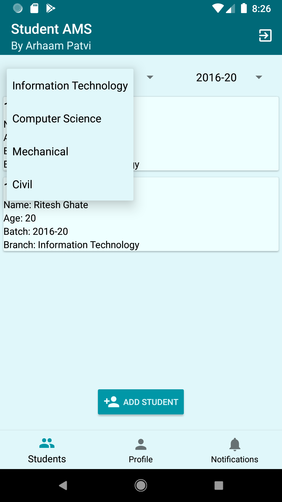

# Android-StudentAMS
"Android" application developed using AndroidStudio with connectivity to Firebase Realtime Database for Student Attendance Management.
 
<table>
  <!--ROW 1-->
  <tr>  
    <td>1)Staff Login</td>
    <td>2)Staff Profile</td>
    <td>3)Staff–Students Fragment</td>
  </tr>
  <tr>
    <td></td>
    <td></td>
    <td></td>
  </tr>
  <!--ROW 2-->
  <tr>  
    <td>4)Staff–Students Fragment (Branches)</td>
    <td>5)Staff–Students Fragment (Batches)</td>
    <td>6)Staff–Students Fragment (Student Settings Pop-Up)</td>
  </tr>
  <tr>
    <td></td>
    <td></td>
    <td></td>
  </tr>
  <!--ROW 3-->
  <tr>  
    <td>7)Staff–Students Fragment (Manage Attendance <75%)</td>
    <td>8)Staff–Students Fragment (Manage Attendance – Semester Selection)</td>
    <td>9)Staff–Students Fragment (Update Attendance Pop-Up)</td>
  </tr>
  <tr> 
    <td></td>
    <td></td>
    <td></td>
  </tr>
</table>
 
